# RT Management System (Skill Fit Test)

Aplikasi manajemen administrasi RT untuk pengelolaan data warga, iuran bulanan, pemantauan status rumah, serta laporan keuangan.
Proyek ini dibangun menggunakan **Laravel 11** dan **React 18** (Vite) sebagai syarat seleksi Full Stack Programmer.

---

## 💻 Panduan Instalasi

Mohon ikuti langkah-langkah berikut secara berurutan untuk memastikan aplikasi berjalan dengan baik.

### Prasyarat Sistem
*   PHP >= 8.2 & Composer
*   Node.js (v18+) & NPM
*   MySQL Database

### 1. Persiapan Database
Buat database baru melalui MySQL client (misal: phpMyAdmin):
```sql
CREATE DATABASE skill_fit;
```

### 2. Instalasi Backend (Laravel)
Jalankan perintah berikut di dalam direktori `backend/`:
```bash
# Install dependensi
composer install

# Konfigurasi Environment
cp .env.example .env
# --> Pastikan DB_DATABASE=skill_fit sudah sesuai di file .env

# Inisialisasi aplikasi
php artisan key:generate
php artisan storage:link

# Migrasi & Seeding (Data Dummy)
php artisan migrate:fresh --seed

# Menjalankan server
php artisan serve
```
*Server akan berjalan di `http://127.0.0.1:8000`*

### 3. Instalasi Frontend (React)
Jalankan perintah berikut di dalam direktori `frontend/`:
```bash
# Install dependensi
npm install

# Menjalankan development server
npm run dev
```
*Aplikasi dapat diakses melalui browser di `http://localhost:5173`*

---

## 📊 Entity Relationship Diagram (ERD)

Struktur database dirancang untuk menangani histori penghuni rumah dan pencatatan iuran secara modular.
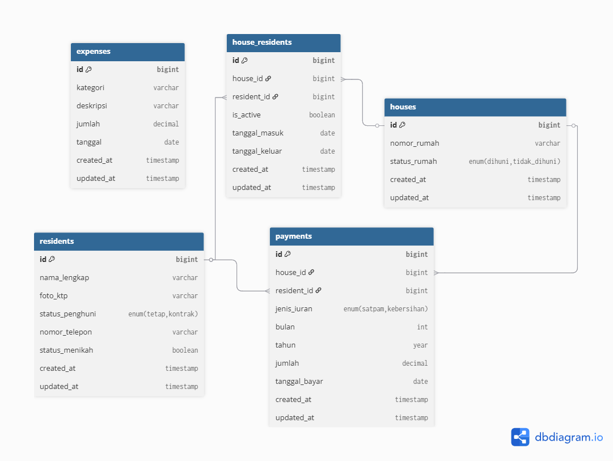

---

## 📸 Foto Implementasi Fitur (Screenshot)

Berikut adalah rangkuman visual dari fitur-fitur yang telah diimplementasikan sesuai dengan requirement tugas:

### 1. Dashboard Keuangan
Ringkasan saldo kas saat ini serta grafik visual pemasukan dan pengeluaran selama satu tahun.
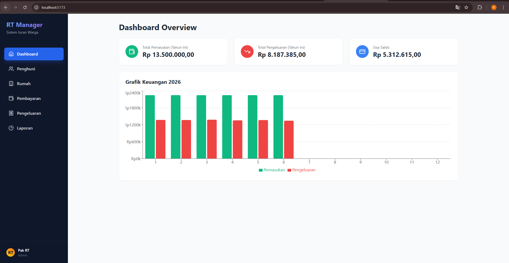

### 2. Manajemen Penghuni
Daftar seluruh warga perumahan beserta rincian data diri, status pernikahan, dan dokumen foto KTP.
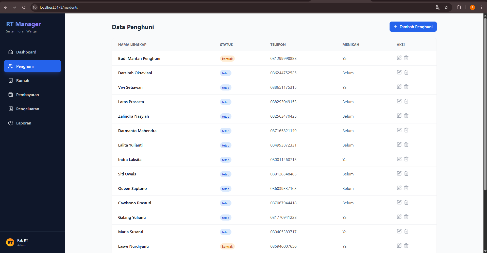
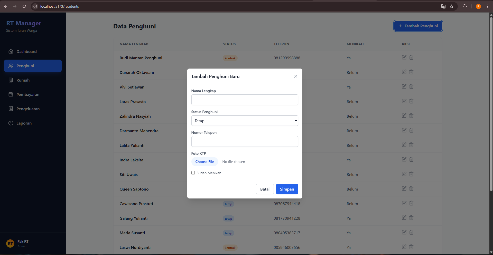 (Modal Tambah/Edit dengan fitur Upload)

### 3. Manajemen Rumah & Historis
Pemantauan status rumah (Dihuni/Tersedia) serta fitur penempatan warga pada rumah tertentu.
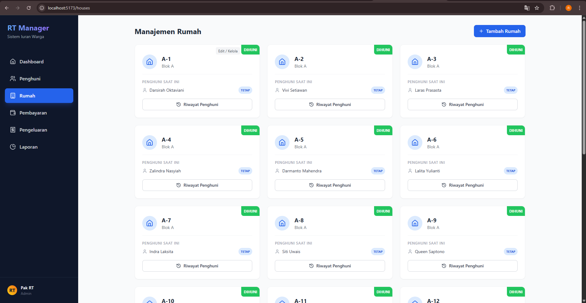 (Tampilan utama grid rumah)
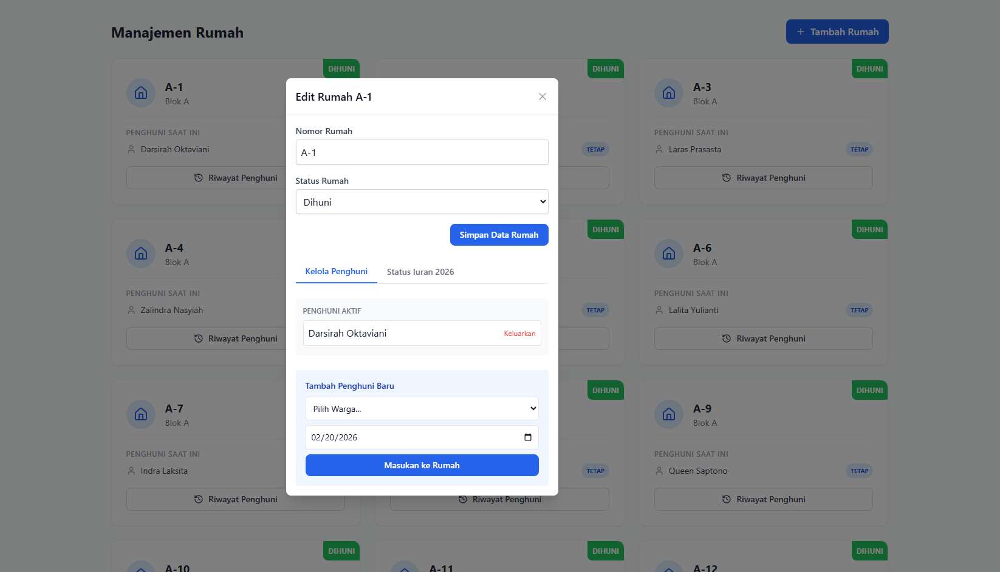 (Modal "Kelola Rumah" pada tab Kelola Penghuni)
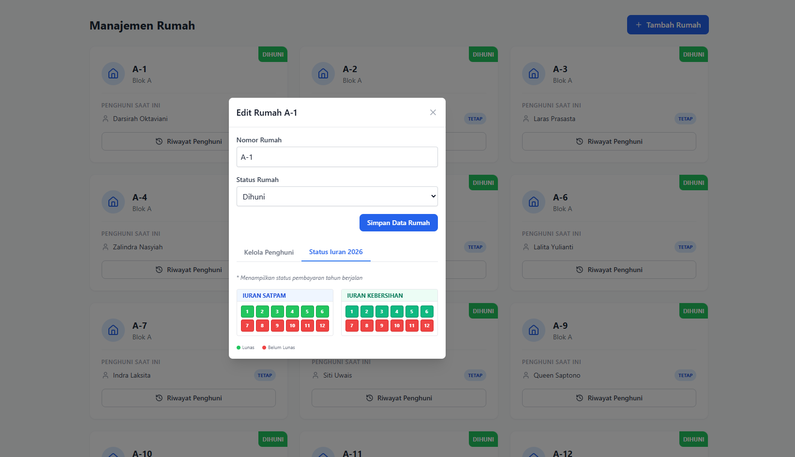 (Modal "Kelola Rumah" pada tab **Status Iuran** - Bukti status lunas/belum per rumah)
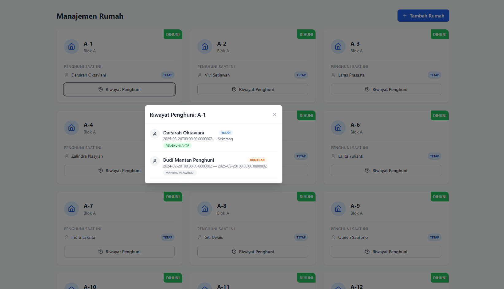 (Catatan historis penghuni per rumah)

### 4. Sistem Pembayaran Iuran
Proses pencatatan iuran (Satpam & Kebersihan) dengan fitur pembayaran langsung untuk periode 1 tahun.
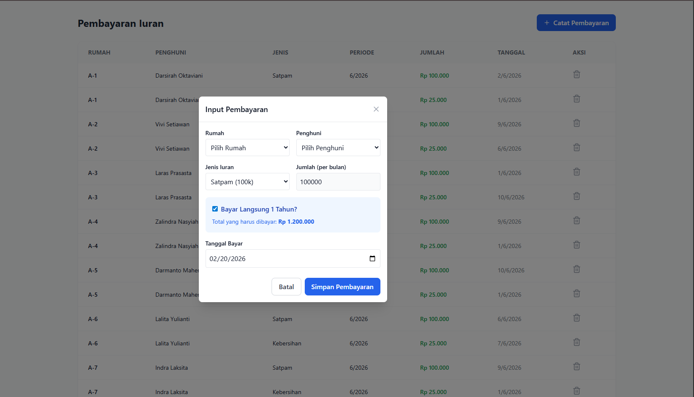

### 5. Manajemen Pengeluaran
Pencatatan pengeluaran operasional RT (Gaji satpam, perbaikan fasilitas, dll) untuk transparansi kas.
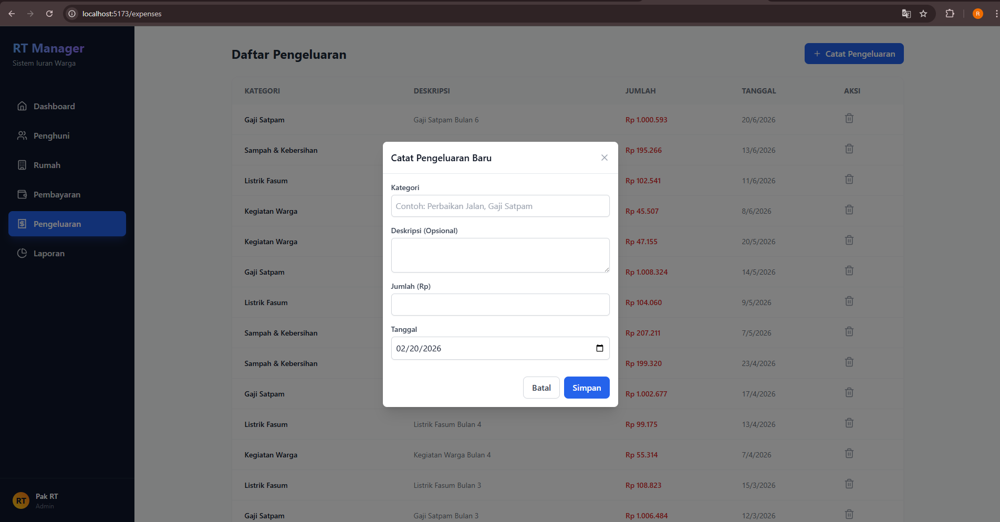

### 6. Laporan Keuangan & Cetak
Fitur rekapitulasi transaksi bulanan dengan layout yang dioptimalkan untuk kebutuhan pencetakan.
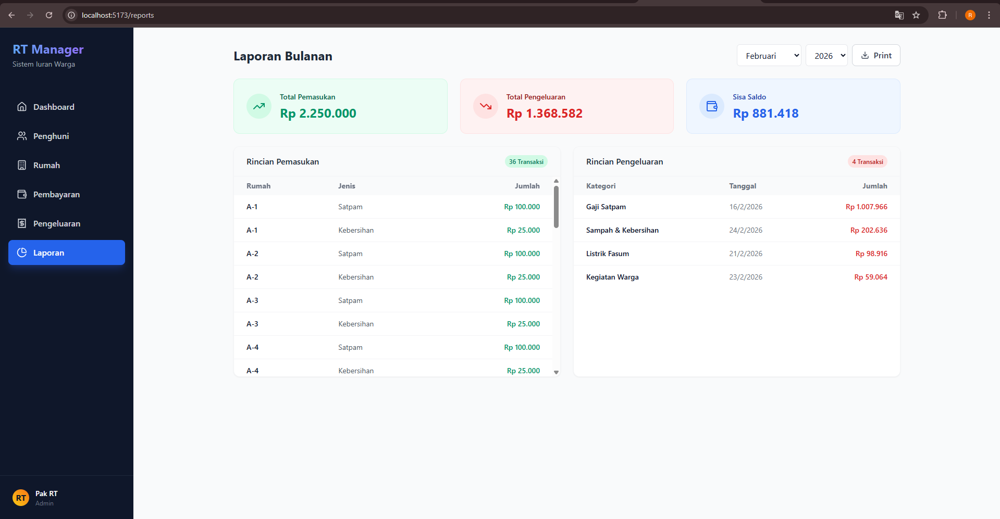
[Lihat Preview Cetak PDF](screenshots/reports_print.pdf) (Tampilan Preview cetak/PDF)
\
